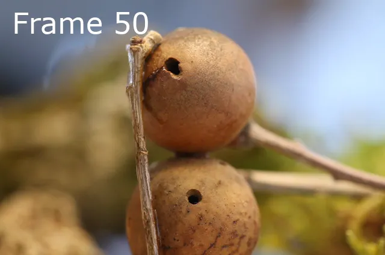
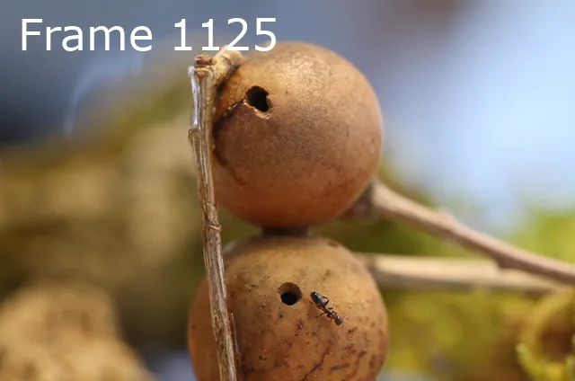
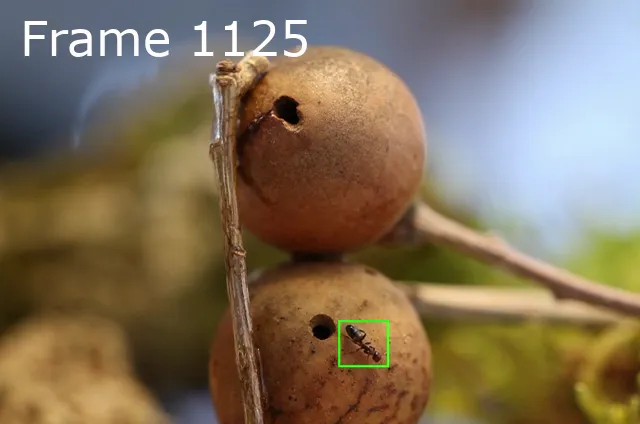

# Detector

This is a small Xcode project containing a class that processes a video using a Core ML object detection model based on Ultralytics YOLOv11n. The model was trained on a custom dataset of approximately 1000 annotated images. The class analyzes the input video frame by frame, detects objects, and generates a new video with all detected objects highlighted using bounding boxes.

---

## Description


### Example

Here is a series of frames from the original video (left) and the generated clip with bounding boxes (right):

<div align="center">
<br/>







</div>

---

## Setup

```bash
git clone <repo>
```

---

## Using the Xcode Project

### Build

- Open `Detector.xcodeproj` in Xcode
- All necessary settings are preconfigured
- Just press `⌘B`

### Run

To run a sample object detection, you can use and download the `clip640x424.mov` file from my repository <link>.

1. Open the Xcode project.
2. Build the project with `⌘B`.
3. In Terminal, change to the build directory:

```bash
   cd <build-dir>
```

4.	Download the sample video:

```bash
    curl -L -o clip.mov <link>
```

5. Run the detection:

- In the Xcode project, press `⌘R` to run the app.
- The output (first 3000 frames) will be written to `clip_detect.mov`.

You can customize the file paths and the end frame directly in the code line inside [main.mm](./Detector/main.mm):

```objc
d.exportDetectedFramesUpTo(3000, [NSURL fileURLWithPath:@"clip.mov"], [NSURL fileURLWithPath:@"clip_detect.mov"]);